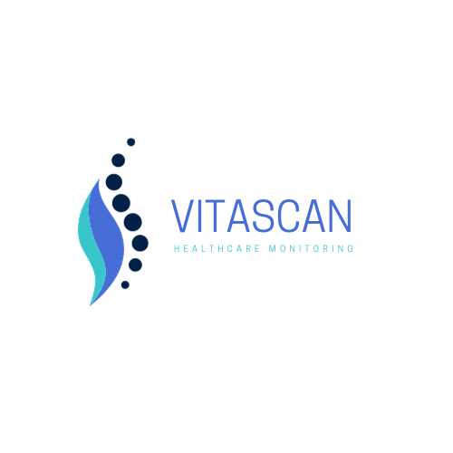
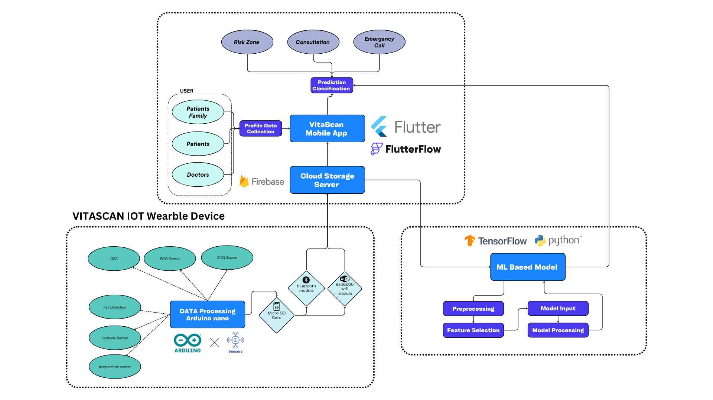
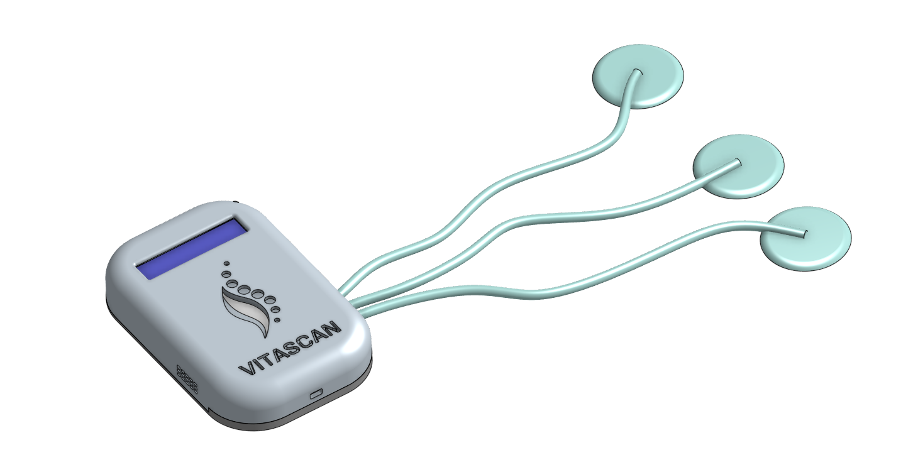

##### the project title :

VITASCAN : healthcare monitoring 
our slogan :
Seamless Care, Strong Hearts: Vitascan IoT, Redefining Heart Health at Your Fingertips

#### Overview :

Our project involves the integration of the Vitascan IoT device with a user-friendly mobile app. This combination allows cardiovascular disease (CVD) patients to conveniently input their health data and receive consultations from their homes. Additionally, the app features a predictive capability enabling users to anticipate potential heart attacks.

#### iot device : VITASCAN :

a multifunctional device “VITASCAN” equipped with sensors 

#### hardware requirements : 

-arduino nano : Microcontroller Board

-esp8266 wifi module :  Wireless Communication Module

-Capteur AD8232 :  Biomedical Sensor

-Humidity Sensor (DHT22)-arduino : Environmental Sensor

-temperature sensor lm35 -arduino 

-CARTE MAX30102 Pulsation Cardiaque : Optical Heart Rate Sensor

-lcd 16x2 with i2c : Display Module

#### software requirements : 

-arduino IDE :  Integrated Development Environment

-arduino libraries : Software Libraries

-communication protocol 

-wifi library 

# usage :

## The IoT device :

"VITASCAN" , powered by the Arduino Nano and equipped with an ESP8266 WiFi module, serves as a versatile hub for connecting and managing various sensors. The AD8232 sensor monitors the patient's heart activity by capturing ECG signals, providing crucial data for cardiovascular health assessment.
The DHT22 and LM35 sensors measure environmental parameters such as humidity and temperature, offering a comprehensive understanding of the patient's surroundings. The MAX30102 heart rate sensor utilizes optical technology to capture pulse and blood oxygen levels. 
The Arduino Nano acting as the central processing unit, orchestrates the collection of sensor data, ensuring seamless integration and correlation of vital health information. 
The Micro SD card in the IoT device serves a crucial role in safeguarding patient data, especially in scenarios where WiFi connectivity may be temporarily disrupted or network instability , Arduino Nano can seamlessly switch to saving data onto the Micro SD card. The saved data can later be retrieved and synchronized with the server or mobile app when the WiFi connection is reestablished 
The ESP8266 adding to bluetooth module facilitates wireless connectivity, enabling the device to transmit real-time data to a remote server ( cloud storage server in our case ) . 
This interconnected system enhances the overall functionality of the IoT device, transforming it into a powerful tool for remote patient monitoring and timely health interventions.

## cloud storage server offers :

data Accessibility , scalability for long-term monitoring and maintaining historical records , real time updates , multiple authorized users can access and collaborate on patient data , remote monitoring , integration with VITASCAN mobile app , for the implementation of data analytics and machine learning algorithms on the stored data
#### used technology : 
firebase

## machine leaning model :

data preprocessing and cleaning data and converting sensor readings into meaningful features ,extract features from the sensor data that can contribute to health predictions , use historical patient data to train the machine learning model ,the model make predictions about potential heart attacks based on ECG data+hanges in vital signs , continuous learning to adapt and learn from new data for effectiveness , integration with cloud services for processing and scalability 
#### used technology :
tensorflow , python 

## VITASCAN MOBILE APP : 
user authentification , dashboard overview providing patient's health satus : heart rate+ ecg data+ temperature + humidity  , provinding real time monitoring vital signs and other parameters , patients receive immediate feedback on any changes , alerts and notifications when the machine learning model detects anomalies or potential health risks , historical data access , user input and feedback ,teleconsultaion features : allowing patients to schedule virtual appointments with healthcare professionals directly through the app , medication Reminders , educational Resources
#### used technology : 
flutter , flutterflow 

